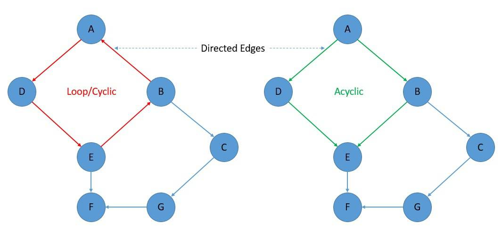
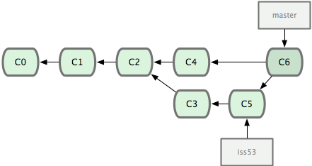
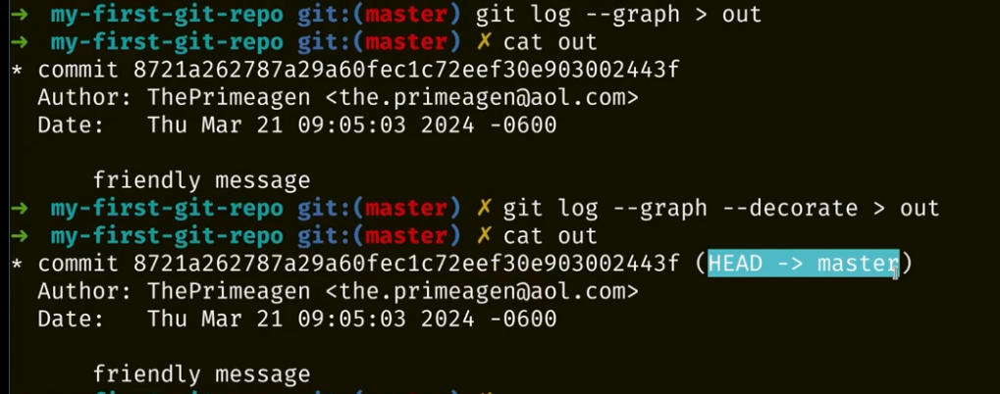
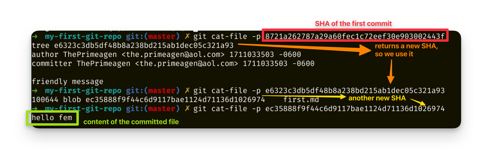

# Notes

## Intro

- `man`
- `man git-<op>`for the friendly manual

- repo
- `commit`: a point in time representing the project **in its entirey**, not just the differentials.
- 'staging area' or index: where you prepare the changes you wish to commit. When you commit, anything in the staging area will be commited. Unstaged items won't be committed.
- 'squash': to take several commits and turn it into one commit. Technically would be taking N commits and turning it into N-1 to 1 commit, but typically its N commits to 1 commit.
- 'work tree', 'working tree' or 'main working tree': your git repo. this is the set of files that represent your project. Your working tree is setup by `git init` or `git clone`. 
- untracked → staged → (commit) → tracked

### Key facts about Git

- git is an acyclic graph, meaning the following cannot exist
- In git, each commit is a node in the graph, and each pointer is the child to parent relationship. Meaning that you can have more than one parent, but you cannot have a cycle in the graph.
- If you delete *untracked* files, they are lost forever. Remember: commit early, commit often, you can always change history to make it one commit (squashing).

Cyclic vs acyclic graphs:

Git graph

- All git config keys are in the following shape: `<section>.<key>`.
- `--global` flag will ensure you set this key value for all future uses of git and repos
- `user.name` `user.email` are the key's used in creating a commit tied to you
- To add a key value, execute `git config --add --global <key> "<value>"`
- You can view any value of git config by executing `git config --get <key>`

## Repos

(...)

- `git init`
- `git add <path-to-file | pattern>` will add zero or more files to *the index* (staging area)
- `git commit -m '<message>'` will commit what changes are present in *the index*.
- `git status` will describe the state of your git repo which will include tracked, staged and untracked changes.

- `git log` has many options to make viewing of history a pleasant experience.
  - `--no-decorate`, `--decorate[=short|full|auto|no]`. Print out the ref names of any commits that are shown. If short is specified, the ref name prefixes refs/heads/, refs/tags/ and refs/remotes/ will not be printed. If full is specified, the full ref name (including prefix) will be printed. If auto is specified, then if the output is going to a terminal, the ref names are shown as if short were given, otherwise no ref names are shown. The option --decorate is short-hand for --decorate=short. Default to configuration value of log.decorate if configured, otherwise, auto.
  - `--graph`. Draw a text-based graphical representation of the commit history on  the left hand side of the output.

`--decorate` is not really that useful, but it is when you export the log to a file. `git log --graph > out` will not print the `(HEAD -> main)` part of the log. It will when the command is `git log --graph --decorate > out`. 

The are ways to inspect files within the git's data store. `git cat-file -p <some-sha>` will echo out the contents of the sha. This can be a commit, a tree or a blob.

We can follow the trace of the SHAs to cat the content of a committed file:

- tree: folder
- blob: file

